# ProjectA

# Dependency

need to Maria DB or DB system for Login , Sign up Page

and need to Photon Cloud server setup or Photon server (PUN2)

# Sever Setup

Foldering

## In Project Folder
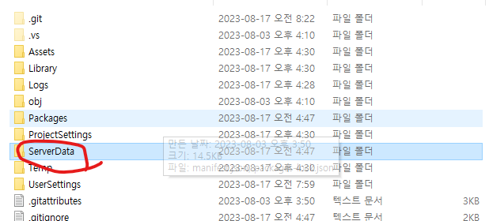

## In Build Folder
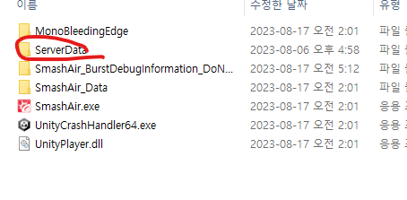

## Server Json File Set
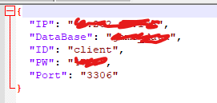

## If You Want Custom

You can Custom Source of This Link https://github.com/dMinsz/ProjectA/blob/master/Assets/Network/Scripts/DBManager.cs

# Game Play

## Login & SignUp

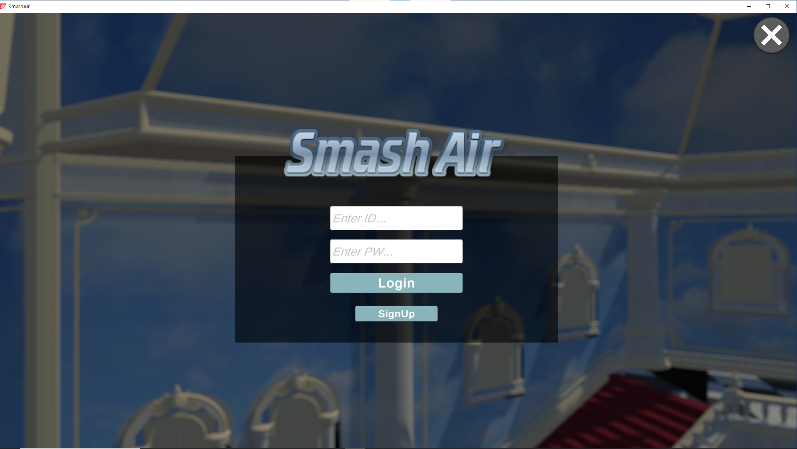

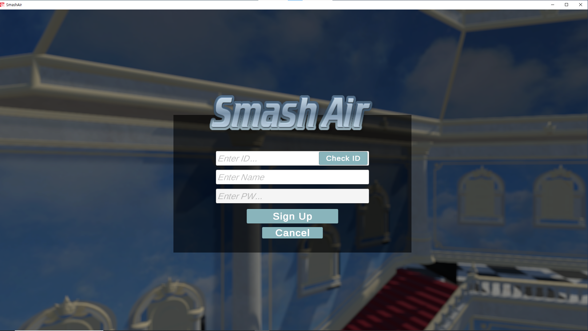

## Match Making

You can matchmake by logging in.

1vs1 , 2vs2, 3vs3

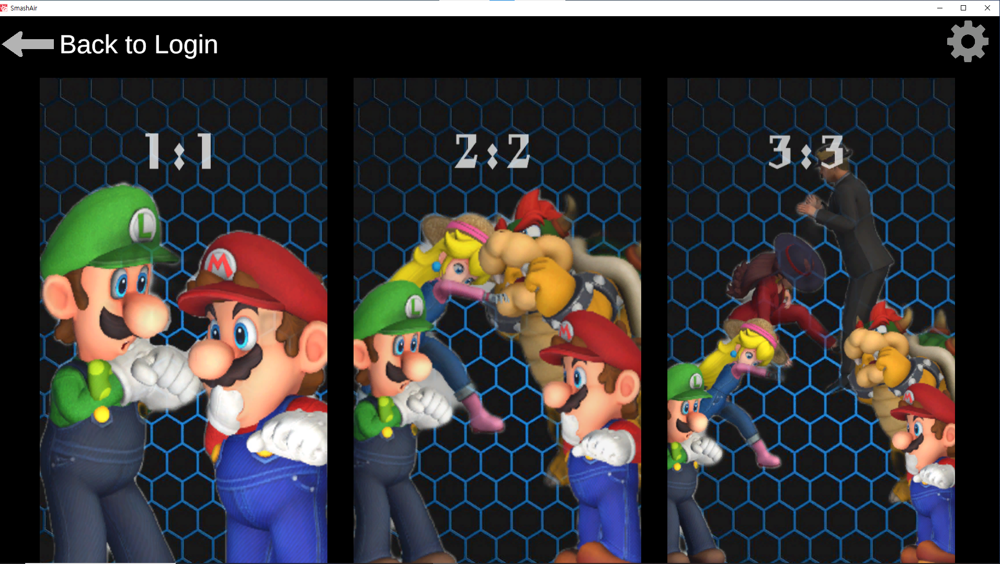

## Choose Character (In Room)

After the matchmaking, the character selection scene will appear.

You get to choose a character with other users.

If everyone is ready
The host can start the game.

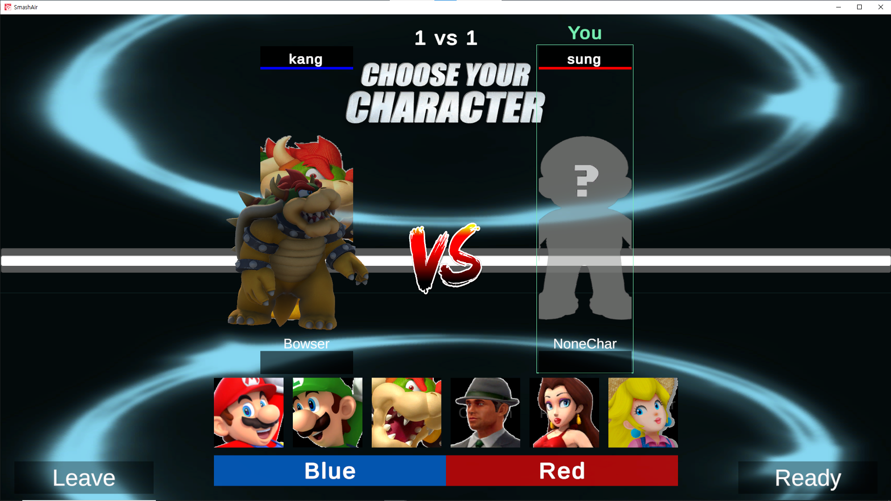

Host Can Start

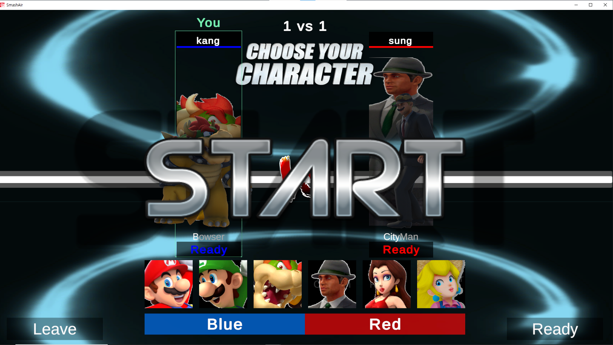

Ohter Player Waitng

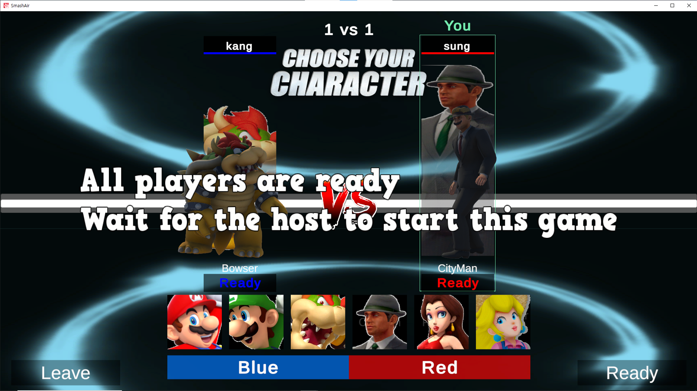

# In Game

## Count Down

When you start the game, it waits for all players to enter the game scene, then the game starts 5 seconds later.

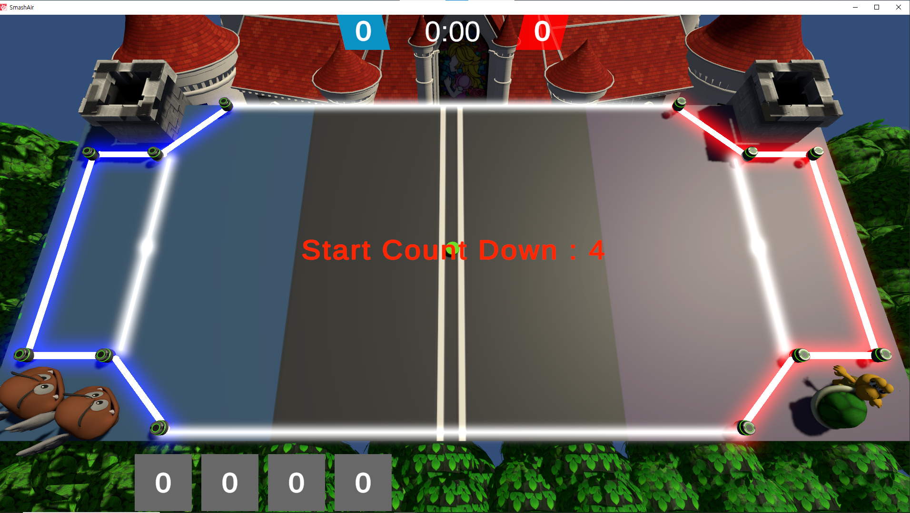

## Player Attack and Use Skill

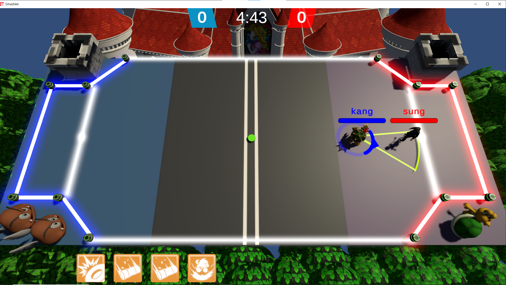

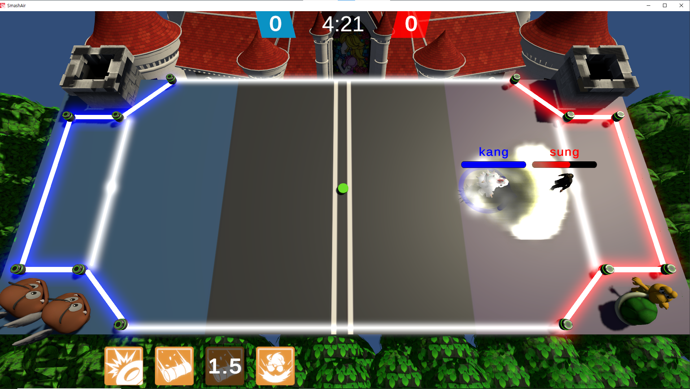

If there is a user from another team within the range of the skill

Can Damage

## Play and EndGame

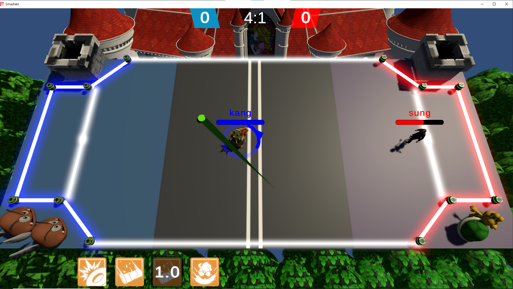

The game is over when one team reaches 5 points or when the allotted time runs out.

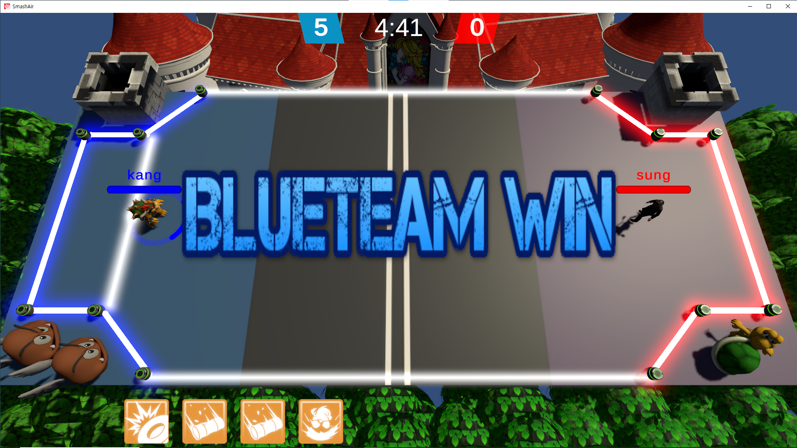

# Delay compensation

We did not use Photon RigidBody,TransForm View to compensate for server latencies.

You can See this Folder => https://github.com/dMinsz/ProjectA/tree/master/Assets/Network/Scripts/optimization

and Ball Move CCD => https://github.com/dMinsz/ProjectA/blob/master/Assets/Game/Scripts/Puck.cs
